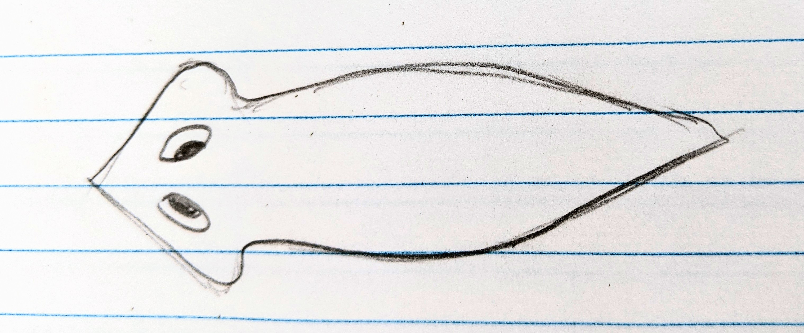
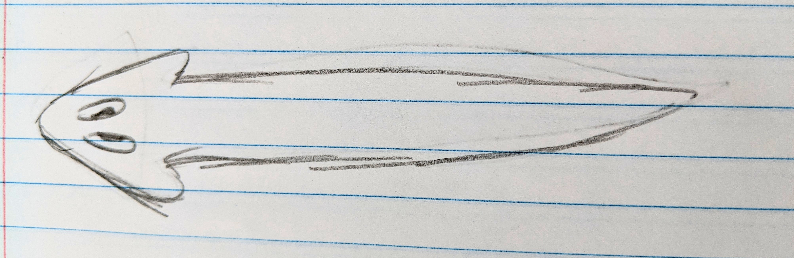

## Introduction

Knowledge about regeneration and stem cells is necessary for advancements in the medical field. Regeneration experiments often use planarians. First, it is more ethical due to how cutting them in half only mimics their asexual reproduction style, where it pulls apart into two pieces and those pieces regenerate into separate planaria. Second, Planarians can quickly regenerate any body part, even the brain, from tiny pieces. Third, Planarians have a lot of adult stem cells, most being pluripotent. Fourth, Planarians are cheap and easy to take care of. Fifth, a good amount of planarian proteins are similar to human proteins. Sixth, RNA interference of planaria can easily be done. (https://doi.org/10.1242/dmm.006692) This paper seeks to find many things, like how planarians regenerate from vertical and horizontal cuts in different areas, especially in the head. Will these tail pieces become full planaria or will they regenerate abnormally? The hypothesis was that each planarian piece not containing a full head would develop one, while full head pieces regenerate a tail normally. The hypothesis was brought about by the diffusion gradient model, where it is assumed that a gradient of morphogen, a chemical substance fixes positional info. Cells should know their positions by sensing the concentration of the morphogen, and they would know which way is up by sensing the direction of the gradient (@tyler_developmental_2000). We were looking to see how the planarian regenerated and if it would be abnormal, mainly if a head fully regenerated. We wanted to see how the planaria reacted to light after these cuts to the head or how the regenerated head reacted. We searched for how long the head had to develop before it regained normal behaviors such as negative phototaxis (definition). We could see if the photoreceptors were working based on their reactions, leading us to the conclusion of which heads were developed. This experiment lasted two weeks, with a fresh batch of planaria being dissected at the beginning of the second week. 


## Methods
The experiment was performed in this manner. Firstly, the planarian would be numbed by putting it in a Petri dish and putting that Petri dish on ice for 1-2 minutes. Secondly, the worm was measured before dissection using a ruler in centimeters. Thirdly, it was cut into the desired areas for the experiment with a razor blade sterilized with rubbing alcohol. Fourthly, each piece was measured post-dissection. Fifthly, each piece was moved into a 12-well plate and its area was labeled for easy keeping. This process would be repeated with multiple worms to have different treatments and controls. The treatments consisted of, splitting just the head in two, cutting the whole planarian vertically in half, a vertical T-cut on the tail while still attached to the head, and where only the tail without the head is vertically cut fully in half. The controls were a planaria that was just cut horizontally right below the head, mimicking its normal
Fission and a normal uncut planaria. The measuring of planarians proved to be difficult at times due to the way they moved. The planarians would scrunch up and stretch out as they moved, and it was difficult to make the planarian pieces fully stretch out on command. (include pictured here) Week 2 planarians were fed, and week one was not. Some dissection differences, like cutting the T-cut treatment on the wrong side, and human error may have affected the gathered data.

:::{figure}
:label: Planaria subfigure
:align: left







Drawings of planaria movement that are not drawn to scale.
:::


## Results
The planarians regrew their head and body parts, but they stayed the same length or even shrunk in length. The planarians that had their head cut in half would run in circles when exposed to light, moving very abnormally, these abnormal movements lessened as more of their head regrew. The planarians of the same treatments of week one and week two exhibited the same actions. The controls moved as normal planarians moved, with negative phototaxis, though the tail control had to regenerate first. However, the treatments would display abnormal movement, they would move in circles and curl into a mound, but as more of their head developed the more normal their behavior became. This is the same for both weeks. The results did indeed support the hypothesis. All the body fragments regenerated heads, or were well on their way to, except for the ones that already had a full head, which generated a tail. The growth of the planarians was tracked as well. The trend was that the planaria that had to regrow their heads either shrank or regrew far less length than those that just regrew tails. Here is a table of the growth after dissection of the planaria where just the head was split in two

:::{table} Head half growth in cm. 
:label: headhalf-table
:align: center

|Days Post Dissection | Head half 1| Head half 2 |
|---                  |---         |---          |
|0                    |0           |0            |
|2                    |-0.025      |-.0.025      |
|5                    |0.02        |0            |
|6                    |0           |-0.03        |
|7                    |0.05        |0.0225       |

:::

In this situation, head half 1 was 0.1cm after dissection, and head half 2 was 0.08cm. Seeing the data found in @headhalf-table, you can see that head half 1 regrew more length than head half 2, showing that having less head resulted in less growth. 
This is also shown through this table of treatments’ and controls’ growth at 7 days post dissection, 

:::{table} Growth at 7 days post dissection in cm.
:label: diff-table
:align: center

|Just head (control) | Vertical T-cut| Full vertical cut |Just tail (control) |
|---                 |---            |---                |---      |
|0.01                |-0.35        |-0.1125  |-0.1|

:::

You can see that in the treatments where the head was affected the growth rate is negative. The one outlier is the Janus T-cut treatment where the tail was cut vertically in half, so as it focused more on healing and less on tail and head growth, it would make sense that it shrank. 

For the treatment where just the tail was cut in half, this data was gathered of the growth post dissection. 

:::{table} Growth for tail half in cm. 
:label: Vtp-table
:align: center

| Days post dissection | Vertical tail piece 1 |
| --- | ---  |
| 0   | 0    |
| 2   |-0.075|
| 5   |0     |
| 6   |0.1   |
| 7   |0.05  |
:::
 You can see in @Vtp-table that the tail piece shrank in the first 3 days as it regrew the head, but then started growing in length as the head was finishing regeneration.

Here is a graph showing all the treatments' and controls' growth over days post dissection. 

 ```{figure} #Planaria
 :label: Planeria-growth-graph
 Treatments and controls growth over time.
 ```


According to these data sets, this paper’s conclusion on the growth of these different cuts is that regrowing the head, or healing in a planaria will result in length shrinkage while regrowing the tail results in growth. 

## Discussion
The results showed how planarians with only one photoreceptor would display abnormal movement and only when the head fully regenerated and there were two photoreceptors did the behavior become more normal. It took nearly the whole week, and for some cuts, they would have needed more time. If this experiment was kept going for longer with more planarians, faulty dissections could be redone and human measurement errors would be less prominent. Since one week of the planarian was fed and the other was not, it would be good practice to measure the speed of regeneration or the length grown after is affected when the planarian eats food and when they are without in a future experiment.


## Conclusion
The results did indeed support the hypothesis. All the body fragments regenerated heads, or were well on their way to, except for the ones that already had a full head, which generated a tail. This provides evidence for the diffusion gradient model as the hypothesis based on the model was correct. 
